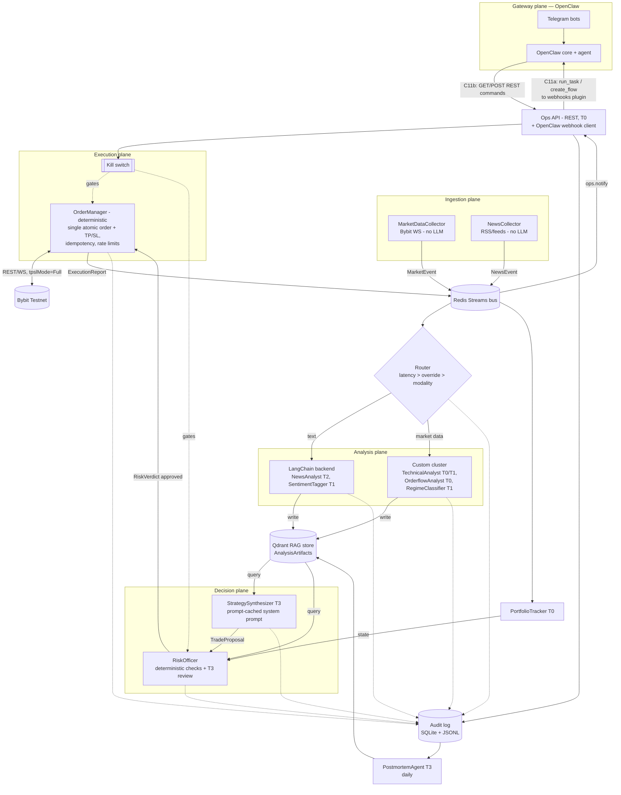

# ihlamurv2 — Multi-Agent Algorithmic Trading System (Bybit Testnet)

> **Status:** v1.3 (2026-07-10) — **implemented as-built + external review hardening**. An
> independent pre-deployment review produced 45 findings; §10 records the full triage —
> 18 accepted and implemented (risk-based sizing, decimal-safe quantities, leverage enforcement,
> post-fill protection verification, gateway model verification, stream retention, dashboard
> XSS/CSP, atomic kill-switch persistence, prompt-injection defenses, ...), the rest deferred
> with rationale (most gated on mainnet, none blocking a supervised testnet trial) or rejected
> as not applicable. v1.2 note follows. All 24 tickets (T-01..T-24, phases
> P0-P7) are built and covered by `make test` (ruff + mypy clean). This revision documents three
> changes made after the initial P0-P7 build, on top of the verified v1.1 design below:
> 1. **Operator dashboard** (§9, new): a browser UI served by the Ops API process — kill switch
>    controls, live PnL/positions, an activity feed, and a `/why` explainer — so operating the
>    system no longer requires curl or Telegram.
> 2. **LLM backend is now dual-mode** (§3, updated): completions default to a subscription
>    **gateway** backend (e.g. an OpenClaw instance signed into your Claude/OpenAI/Gemini
>    accounts) instead of usage-billed API keys; direct `anthropic_api` billing remains available
>    as a fallback. Section 3's hard rule (T3-only for order-triggering output) and the tiering
>    concept are unchanged — only how a tier resolves to a model call changed.
> 2b. **Embeddings still require a key or local model** (§2, §7-8, unchanged decision, re-flagged):
>    subscriptions don't cover the OpenAI embeddings API; `EMBEDDER=local` (fastembed,
>    on-device, no key) is now the shipped default so the system can run fully key-free end to
>    end apart from optional embedding quality.
> Testnet only — no mainnet, no real funds. Experimental / educational system.
>
> **Externally verified facts** (checked against live docs on 2026-07-09):
> - OpenClaw webhooks plugin (docs.openclaw.ai/plugins/webhooks): **inbound-only** ingress,
>   action-based protocol (`create_flow`, `run_task`, `resume_flow`, `finish_flow`, `cancel_flow`, …),
>   `Authorization: Bearer <secret>` auth, responses `{"ok": bool, "routeId": ..., "result"/"error": ...}`,
>   optimistic concurrency via `flowId` + `expectedRevision`.
> - Bybit v5 create-order supports atomic TP/SL attachment via `takeProfit`/`stopLoss`/`tpslMode`
>   (`Full` requires `tpOrderType`/`slOrderType` = `Market`), triggered by `tpTriggerBy`/`slTriggerBy`.
> - Bybit retCodes: **10006** = API rate limit, **10018** = IP rate limit, **10016** = server error,
>   **10007** = user authentication failed (never retry), **110072** = duplicate `orderLinkId`
>   (linear/UTA; spot equivalent 170141).

---

# Architecture Description

The system is a pipeline of five planes, with the fixed architecture decisions slotted in and all
open decisions resolved (and justified) below:

**1. Gateway plane (OpenClaw + Ops API).** Owns Telegram bot bindings, process lifecycle, and
session memory. Integration is bidirectional but asymmetric, matching OpenClaw's real
capabilities:
- *Outbound (system → Telegram):* the trading system POSTs action requests (`run_task` for
  notifications, `create_flow` for acknowledgeable critical alerts) to OpenClaw's inbound-only
  webhooks plugin; the Telegram-bound OpenClaw agent delivers the message.
- *Inbound (Telegram → system):* the operator talks to the OpenClaw agent, which calls our local
  REST Ops API as a tool.
- *Human-facing (browser → system):* the same Ops API process also serves a **web dashboard**
  (§9) at `/` — kill-switch controls, PnL/positions, activity feed, `/why` — as a second,
  Telegram-independent operator surface with its own bearer token.
OpenClaw never sees market logic and never holds a Bybit key.

**LLM completions are a separate integration from the Telegram gateway above** (§3): the tiered
LLM client can route every completion through a subscription-backed **gateway** endpoint
(`LLM_GATEWAY_URL`) instead of calling provider APIs with billed keys — in practice this is often
the *same* OpenClaw instance (or another OpenAI-compatible proxy) signed into your Claude/OpenAI/
Gemini accounts, but it is a distinct connection, URL, and secret (`LLM_GATEWAY_TOKEN`) from the
Telegram webhooks plugin above, and can point anywhere OpenAI-compatible.

**2. Ingestion plane.** Two collectors, no LLMs: a market-data collector (Bybit v5 WebSocket:
klines, orderbook deltas, trades, funding, open interest) and a news/text collector
(RSS/feed scrapers). Both normalize into typed events on a Redis Streams message bus.

**3. Analysis plane.** The router (deterministic, rule-based with a feedback loop — Section 1)
sends each event to one of the two fixed backends: **LangChain chains** for unstructured text,
**the custom cluster** (worker pool + Redis Streams bus, built by us) for numeric market data.
Both backends emit the *same* output type — an `AnalysisArtifact` — which they write to the RAG
store (Qdrant). RAG is the only handoff mechanism between analysis and decision.

**4. Decision plane.** A Strategy Synthesizer agent (top LLM tier) queries RAG for recent
artifacts per symbol and produces a `TradeProposal`. The Risk Officer (deterministic checks first,
then top-tier LLM review) converts it to a `RiskVerdict` — approve with sizing, or veto. Nothing
reaches execution without a verdict.

**5. Execution plane.** A deterministic, LLM-free order manager: idempotent order placement
against Bybit Testnet using a single atomic order per proposal (entry with TP/SL attached via
`tpslMode="Full"`), rate-limit-aware retry, position + protective-order reconciliation, kill-switch
enforcement. It publishes `ExecutionReport`s consumed by the portfolio tracker, the audit log, and
Telegram notifications.

Cross-cutting: an append-only **audit log** (SQLite + daily JSONL) records every event, LLM call,
decision, order, and fill, linked by `trace_id`; a **kill switch** state readable by every
component; a **scheduler** for retention cleanup, daily postmortems, and router-quality evaluation.

## Component / Data-Flow Diagram



---

# 1. Routing Policy

**Decision: deterministic modality rules as the base signal, a config-table override layer fed by a
measured-quality feedback loop, and a hard latency budget as the supreme disqualifier. No LLM-based
complexity scoring in the hot path.**

**Precedence, highest to lowest: latency > override > modality.** Evaluation order:

1. **Modality rule** computes the *default* backend: `kind` prefix `text.*` (`text.news`,
   `text.social`, `text.filing`) → LangChain; `market.*` (`market.kline`, `market.orderbook`,
   `market.trades`, `market.funding`, `market.oi`) → cluster. This decides ~100% of traffic in
   practice.
2. **Override table** (`configs/routing_table.yaml`, keyed `(source, kind)`, hot-reloaded on
   change) **beats modality**: if an entry exists, it replaces the default. This is the point of
   the table — it lets measured performance move traffic against the modality default.
3. **Latency budget beats everything, including overrides**: each event kind has a `deadline_ms`
   in config; if `deadline_ms[kind] < 2000`, the backend is forced to `cluster` no matter what
   rules 1–2 chose (LLM chain latency is multi-second). Orderbook and trade events have
   `deadline_ms = 500`. When the latency rule vetoes an override, the router logs
   `rule_fired="latency"` **and** emits a one-time `ops.notify` warning naming the overridden
   table entry, so a silently-ignored config line can't sit unnoticed.

Equivalent pseudocode (this exact function is the T-14 spec):

```python
def route(kind: str, source: str) -> tuple[Backend, RuleFired]:
    backend, fired = (LANGCHAIN, "modality") if kind.startswith("text.") else (CLUSTER, "modality")
    if (source, kind) in override_table:
        backend, fired = override_table[(source, kind)], "override"
    if deadline_ms[kind] < 2000 and backend != CLUSTER:
        backend, fired = CLUSTER, "latency"     # veto + ops warning
    return backend, fired
```

**The feedback loop:** every `AnalysisArtifact` records which backend produced it. A weekly
scheduled job computes, per `(source, kind, backend)`, a *signal quality score*: the fraction of
directional artifacts whose direction matched the sign of the 4-hour forward return of the
referenced symbol (measured from audit-logged market data). Additionally, events can be
**shadow-duplicated** to the non-selected backend with `shadow=true` (their artifacts are stored
but flagged and never read by the Synthesizer). **Updated (v1.3, review item 11):** shadow rates
are per-kind (`settings.router.shadow_rates`) and default to **disabled** — a shadow copy is only
meaningful when the other backend has a processor capable of that modality, and currently neither
does (cluster workers drop `text.*`, the LangChain pipeline drops `market.*`), so the original
blanket 5% produced zero comparable artifacts. Enable per kind when a counterpart processor
(e.g. a rule-based news tagger) exists.
The job writes a report; routing-table changes are applied by a human (or proposed by the
Postmortem agent via Telegram), never automatically — a self-modifying router is an unnecessary
failure mode at this stage.

**Why not complexity scoring:** scoring "complexity" per event requires either an LLM call (adds
cost + latency to *every* event, including 100/sec orderbook deltas) or heuristics that collapse
into data-type rules anyway. Modality is a near-perfect proxy here: text needs language
understanding (LangChain's strength), numeric streams need deterministic feature math (the
cluster's strength). Start with the cheap rule that's right 99% of the time, and let measured
performance — not a priori scoring — move the boundary.

---

# 2. RAG Implementation

**Embedding model:** OpenAI `text-embedding-3-small` (1536 dims) when `EMBEDDER=openai`.
Rationale: embeddings are a commodity decoupled from the reasoning-model vendor; this one is
cheap (~$0.02/1M tokens), multilingual (news sources may be Turkish/English), and stable.
**Default, and fallback for CI/offline dev:** local `BAAI/bge-small-en-v1.5` (384 dims) via
`fastembed` behind the same `Embedder` interface, selected by `EMBEDDER=local` — tests must
never need an API key. **Updated (v1.2):** with the LLM backend now subscription-based (§3), the
OpenAI embeddings API is the one remaining place an API key would be needed end-to-end — it has
no subscription equivalent — so `EMBEDDER=local` is now the shipped `.env.example` default,
making the whole system runnable key-free. The two embedders are **not interchangeable on an
existing collection** (different vector dimension); switching requires recreating the Qdrant
collection.

**Vector store:** **Qdrant**, self-hosted via Docker (`qdrant/qdrant:v1.13.4`, named volume).
Rationale over alternatives: pgvector would mean tuning Postgres for ANN; Chroma is weaker on
payload filtering; Pinecone is hosted (unwanted dependency + cost for a testnet experiment).
Qdrant's payload filtering (symbol, time range, agent, type) is exactly the query pattern below,
and it runs in one container.

**Collection:** single collection `artifacts`, cosine distance, with payload indexes on `symbol`,
`content_type`, `producing_agent`, `created_at`.

**Storage schema (Qdrant point):**

```
id:      UUIDv4 (doc_id)
vector:  float[1536]         # embedding of `content`
payload:
  content: str               # the analysis text itself (≤ 2000 chars)
  content_type: enum         # news_analysis | market_signal | regime_note |
                             # trade_proposal | risk_note | postmortem
  symbol: list[str]          # e.g. ["BTCUSDT"]; [] = market-wide
  timeframe: str|null        # "1m"|"15m"|"1h"|"4h"|"1d"|null
  direction: enum|null       # long | short | neutral | null
  confidence: float          # 0.0–1.0, producer-assigned
  producing_agent: str       # e.g. "news_analyst"
  backend: enum              # langchain | cluster | decision
  source: str                # upstream origin, e.g. "coindesk_rss", "bybit_ws"
  trace_id: str              # links to audit log
  shadow: bool               # true = shadow-routed, excluded from reads
  created_at: str            # ISO-8601 UTC
  ttl_class: enum            # fast | slow | permanent
  schema_version: int        # starts at 1
```

**Retention policy:** driven by `ttl_class`, enforced by a nightly cleanup job (Qdrant
delete-by-filter on `created_at`): `fast` (market_signal, regime_note) — **24 h**; `slow`
(news_analysis) — **7 days**; `permanent` (trade_proposal, risk_note, postmortem) — never deleted
from Qdrant, and additionally mirrored into the SQLite audit DB at write time so the decision
trail survives even a Qdrant volume wipe. Rationale: market signals decay in hours; stale signals
in RAG are actively harmful because the Synthesizer retrieves by similarity, not just recency.

**Per-agent-role query patterns** (all reads exclude `shadow=true`):

| Reader | Query |
|---|---|
| StrategySynthesizer | Filter: `symbol=X`, `created_at > now-4h`, `content_type ∈ {market_signal, news_analysis, regime_note}`; semantic query text = "current trading signals and catalysts for X"; top-k=12, then re-rank by `0.6·similarity + 0.3·recency_decay(2h half-life) + 0.1·confidence` |
| RiskOfficer | Filter: `symbol=X`, `content_type ∈ {risk_note, postmortem}`, `created_at > now-30d`; query = proposal rationale text; top-k=5 |
| PostmortemAgent | Filter: `trace_id = <trade's trace_id>` (exact payload filter, no vector search) — reconstructs everything that fed one trade |
| Ops API (`/why` queries) | Filter: `content_type=trade_proposal`, most recent for symbol; then `trace_id` fan-out like Postmortem |

Analysis agents (news, technical) are **write-only**: they must not read RAG, so one agent's
output can't feed back into another's input and create echo loops. Only decision-plane and review
agents read.

---

# 3. LLM Tier Definitions

**Decision: three LLM tiers plus an explicit Tier 0 ("no LLM"). The tier concept is
vendor-agnostic; which vendor/model actually answers a tier is a runtime backend choice (below),
not a design-time one** — the tiering, the hard financial-action rule, and the cost-control
cadence are unchanged from v1.1 regardless of backend.

**Backend (T-06, `common/llm.py`), selected by `LLM_BACKEND` / `settings.llm.backend`:**

| Backend | How it works | Needs | Cost model |
|---|---|---|---|
| **`gateway`** (default) | Every tier's completion is a `POST {LLM_GATEWAY_URL}/v1/chat/completions` (OpenAI-compatible wire format) to an endpoint that holds your provider logins — typically an OpenClaw instance (or any OpenAI-compatible proxy) signed into your Claude/OpenAI/Gemini **subscriptions**. Tier→model comes from `settings.llm.gateway_tiers`, so tiers can be split across vendors. | `LLM_GATEWAY_URL` (+ optional `LLM_GATEWAY_TOKEN`). No provider API keys in this process. | Flat-rate: the cost meter prices unknown (gateway) models at **$0** — the guardrail that matters is call *count*, not dollars (below). |
| **`anthropic_api`** | Direct Anthropic SDK, `settings.llm.tiers` model IDs, 1h-TTL prompt caching on the static system block (unchanged from v1.1). | `ANTHROPIC_API_KEY` | Usage-billed; priced via `PRICING_USD_PER_MTOK`. |

The **LangChain backend's SentimentTagger/NewsAnalyst** also go through this same client (via a
`TieredChatModel` adapter that presents a LangChain-shaped `.invoke()` over `TieredLLMClient`),
so backend selection, retries, budget, and audit logging have exactly one choke point regardless
of which analysis backend is calling.

| Tier | Anthropic-API model | Task types |
|---|---|---|
| **T0 — deterministic** | none | Order execution, risk limit checks, indicator/feature computation, routing, orderbook analytics, portfolio accounting, idempotency, retries, Ops API responses (structured JSON — the OpenClaw agent does Telegram formatting). *Anything with a correct answer computable in code must not use an LLM.* |
| **T1 — cheap/fast** | `claude-haiku-4-5-20251001` | News relevance classification & dedup, sentiment tagging, entity/symbol extraction, regime label summarization, artifact summarization for RAG |
| **T2 — mid** | `claude-sonnet-5` | News analysis chains (impact reasoning), regime classification narratives, weekly router-quality report drafting, postmortem drafting |
| **T3 — top** | `claude-opus-4-8` | Trade proposal synthesis, risk review of proposals, final postmortem judgment, anything whose output can trigger an order |

Hard rule (**unchanged, backend-independent**): **any output that can cause a financial action
(proposal, risk verdict) must come from T3**, and even then only passes to execution after T0
deterministic risk checks. Cost control: T3 is invoked at most once per proposal cycle (default:
every 15 min per active symbol, plus event-triggered on high-confidence artifacts), not per
market tick.

**Two independent T3 guardrails, checked before every T3 call:**
1. `daily_llm_budget_usd` — a dollar meter; only load-bearing on the `anthropic_api` backend
   (gateway models cost $0 in the meter, so this alone would never trip there).
2. `daily_t3_call_limit` (new, default 300) — a hard cap on T3 **call count**, enforced on
   *either* backend. This is the guard that actually matters for subscription plans: they meter
   usage/rate, not dollars, and a runaway proposal loop needs to halt before it exhausts a plan's
   quota, not just before it "costs too much." `BudgetExceeded` is raised by either guard.

**On `anthropic_api`, T3 static prompts are still prompt-cached with a 1-hour TTL** (see T-06/
T-15) — with 2 symbols × 4 cycles/hour hitting one hourly cache write, this cuts the
static-prompt share of T3 input cost by roughly 85–90%. On the `gateway` backend, prompt caching
(if any) is the gateway/provider's own concern — `cache_control` is an Anthropic-API-specific
parameter and does not travel over the OpenAI-compatible wire format; cached-token counts are
still surfaced in the result when a gateway reports `prompt_tokens_details.cached_tokens`.

---

# 4. Agent Hierarchy

| Agent | Plane / backend | Responsibility | LLM tier | RAG read | RAG write |
|---|---|---|---|---|---|
| MarketDataCollector | Ingestion | Bybit WS → normalized `MarketEvent`s on bus; staleness heartbeat | T0 | — | — |
| NewsCollector | Ingestion | Poll RSS/feeds → `NewsEvent`s; hash-based dedup | T0 | — | — |
| Router | Routing | Apply Section-1 policy (latency > override > modality); emit `RouteDecision`; shadow duplication | T0 | — | — |
| SentimentTagger | LangChain | Relevance filter + sentiment/entity extraction on news; drops noise before T2 | T1 | — | — (feeds NewsAnalyst in-chain) |
| NewsAnalyst | LangChain | Chain: tagged news → impact reasoning → `AnalysisArtifact` (news_analysis) | T2 | — | ✅ news_analysis |
| TechnicalAnalyst | Cluster | Indicators (EMA/RSI/ATR/vol) per timeframe → market_signal artifacts; T1 only to phrase the signal summary | T0 (+T1 summary) | — | ✅ market_signal |
| OrderflowAnalyst | Cluster | Orderbook imbalance, CVD, large-trade detection → market_signal artifacts | T0 | — | ✅ market_signal |
| RegimeClassifier | Cluster | Trend/range/high-vol regime per symbol, hourly → regime_note | T1 | — | ✅ regime_note |
| StrategySynthesizer | Decision | Query RAG per symbol, synthesize into `TradeProposal` or explicit no-trade | **T3** (prompt-cached) | ✅ signals/news/regime | ✅ trade_proposal |
| RiskOfficer | Decision | T0 hard limit checks → T3 qualitative review → `RiskVerdict` with final size | T0 + **T3** (prompt-cached) | ✅ risk_note/postmortem | ✅ risk_note |
| OrderManager | Execution | Idempotent single-order lifecycle with atomic TP/SL; kill-switch enforcement; reconciliation incl. protective-order check | T0 | — | — |
| PortfolioTracker | Execution | Positions, equity, realized/unrealized PnL, daily-loss counter | T0 | — | — |
| PostmortemAgent | Review (scheduled) | Daily: closed trades → what worked/failed → postmortem artifacts + Telegram digest | T2 draft, T3 verdict | ✅ all (incl. shadow) | ✅ postmortem |
| Ops API + OpenClaw client | Gateway bridge | REST commands from OpenClaw agent; notifications into OpenClaw webhooks plugin | T0 (no LLM) | ✅ trade_proposal + trace fan-out | — |

Hierarchy in one sentence: collectors → router → analysts (write-only into RAG) → Synthesizer
(reads RAG, proposes) → RiskOfficer (approves/vetoes/sizes) → OrderManager (executes) →
PortfolioTracker/Postmortem (close the loop), with the Ops API as the only human-facing surface
and the kill switch gating both decision and execution planes.

---

# 5. Risk & Safety Layer

None of this is optional even on testnet — argued at the end of this section.

**Position & size limits (T0, enforced in RiskOfficer pre-check AND re-checked in OrderManager):**
- Max **3** concurrent positions; max **1** position per symbol.
- **Risk-based sizing (v1.3, review item 6):** the loss-if-stopped is the controlled variable —
  `qty = min(equity·max_risk_per_trade_pct / |entry−stop|, notional_cap/entry) · conviction`,
  floored to lot size in Decimal space (no binary-float step artifacts reach the exchange).
  Conviction can only reduce size, never raise the risk budget.
- Max position notional: **min(5% of testnet equity, 1,000 USDT)** (the `notional_cap` above).
- Max leverage **3×** in the verdict; **the OrderManager enforces the verdict's leverage on the
  exchange (`set_leverage`) before every entry (v1.3, review item 8)** — the account's default
  leverage never silently applies; failure to set it fails closed (no order). Only USDT-perp
  linear contracts; symbol allowlist (`BTCUSDT`, `ETHUSDT` initially).
- Every position requires a stop-loss in the proposal; max stop distance 3% from entry. The stop
  is **requested atomically at order creation** (`tpslMode="Full"`) and — because attachment
  parameters are not proof (v1.3, review item 5) — **verified**: an immediate post-placement
  position query re-attaches a missing stop at once, and the 60 s reconciler re-verifies every
  cycle, escalating to a kill-switch trip (`UNPROTECTED_POSITION`) if a stop cannot be confirmed
  by the second cycle. The guarantee is *verified protection within seconds and halt on failure*,
  not an absolute "never unprotected for one tick".
- **Daily loss limit: −5% of start-of-day equity → automatic HALT until next UTC day** (manual
  resume still required).
- Self-throttle: max 10 order operations/minute, max 50 orders/day.
- Market-order slippage guard: reject if last mark price moved >1% from proposal reference price.

**Kill switch / circuit breaker:** a single state (`RUNNING | HALTED`) stored in Redis key
`killswitch` **and** mirrored to a local file `state/killswitch` (survives Redis restart; HALTED
wins on disagreement). **The file is written atomically — tmp + fsync + rename — and an existing
but corrupted/unreadable file reads as HALTED, never as a RUNNING default (v1.3, review
item 27).** Checked by RiskOfficer before verdicts and OrderManager before every order
call. Triggers:
1. manual `/halt` via Telegram;
2. daily loss limit;
3. market-data staleness >60 s while positions are open;
4. ≥5 consecutive Bybit API errors;
5. reconciliation mismatch — local position state ≠ exchange state after one reconcile retry;
6. **unprotected position** — an open position whose protective stop is missing and could not be
   re-attached (see reconciliation, below);
7. **retCode 10007 (authentication failed)** — never retried; retrying auth failures risks a key
   lockout.

On trip: cancel open **entry** orders, keep positions (flattening on possibly-bad data is worse),
push critical Telegram alert (via `create_flow`, acknowledgeable), refuse all new orders.
(Clarified v1.3, review item 15: with `tpslMode="Full"`, TP/SL live on the *position*, not as
separate orders — order cancellation is structurally incapable of stripping protection.) Resume:
manual `/resume` + a confirmation within 60 s (two-step token flow enforced server-side, so a
fat-finger — or a misbehaving gateway agent — can't re-arm it).

**Order idempotency:** every proposal produces exactly **one** atomic order (entry with TP/SL
attached), carrying a deterministic client ID:
`orderLinkId = uuidv5(NAMESPACE_IHLAMUR, f"{proposal_id}:entry")`. Before any placement,
OrderManager does `INSERT OR IGNORE` into the SQLite `orders` table keyed on `orderLinkId`; if the
row existed, it first queries Bybit by `orderLinkId` and only re-sends if the order is genuinely
absent. Retries of a failed/timed-out placement reuse the *same* `orderLinkId` — Bybit rejects
duplicates server-side with **retCode 110072 ("OrderLinkedID is duplicate", verified)**, giving
two independent layers of dedup. A proposal can therefore never produce two entries no matter how
many retries occur.

**API key/secret handling:** testnet keys created with trade permission only, no withdrawal
(testnet has no real withdrawal, but the habit matters). Stored solely in `.env` (gitignored) +
loaded via `pydantic-settings`; only the OrderManager process reads the Bybit keys; the OpenClaw
webhook secret and Ops API token are separate secrets with the same handling. Secrets never enter
bus messages, RAG payloads, LLM prompts, Telegram output, or logs. A logging filter redacts
anything matching configured secret values as defense-in-depth. `.env.example` committed with
placeholders.

**Rate limits & retry/backoff (all retCodes below verified against Bybit v5 docs):**
client-side token bucket at **8 req/s** for private REST (below Bybit's 10/s default) so we
throttle ourselves before Bybit does.

| retCode | Documented meaning | Handling |
|---|---|---|
| 10006 | Too many visits — API rate limit | Retry: full-jitter backoff 0.5/1/2/4/8 s, max 5 |
| 10018 | Exceeded the IP rate limit (legacy retCode) | Same backoff, and halve the client token-bucket rate for 60 s |
| HTTP 403 | IP rate-limit breach at the HTTP layer (current Bybit behavior; v1.3, review item 14) | Treated exactly like 10018: backoff + halve the bucket for 60 s |
| 110043 | `set_leverage` to the current value ("leverage not modified"; v1.3) | Success, not an error |
| 10016 | Server error | Retryable with backoff; mutating calls only after `query_by_link_id` state check |
| 10007 | User authentication failed | **Never retry.** Trip kill switch (`AUTH_FAILURE`), critical alert |
| 110072 | Duplicate `orderLinkId` (linear/UTA) | Expected outcome of idempotency: map to `duplicate_suppressed`, then `query_by_link_id` for real state. (Spot equivalent 170141 — noted, out of scope; we trade linear only) |

HTTP 429 is treated like 10006, honoring `X-Bapi-Limit-Reset-Timestamp` when present. **Reads
retry freely; order-mutating calls never blind-retry** — on ambiguous failure (timeout) they
re-check state by `orderLinkId` first. WebSocket disconnects: auto-reconnect with backoff; >60 s
gap trips the staleness circuit breaker.

**Why all of this on testnet:** (1) the entire point of testnet is validating the system you'll
trust later — a safety layer bolted on afterward is untested when it finally matters; (2) an
agentic system with retry loops can go pathological (duplicate-order storms, LLM-triggered order
spam) and burn API rate limits or corrupt the experiment's data even with fake money; (3) the
daily-loss halt and audit trail are what make the validation results in Section 6 interpretable at
all — without limits, one runaway session invalidates a week of evaluation data. Cost of
implementation is ~3 tickets; cost of omission is an untrustworthy experiment.

---

# 6. Validation Plan

Five stages, each with exit criteria; the system may not place a testnet order until Stage 3
passes.

**Stage 0 — unit & contract tests.** Every module's tests pass in CI with no network and no API
keys (fake embedder, recorded Bybit fixtures). Contract round-trip tests: every schema in Section
8c serializes/deserializes losslessly.

**Stage 1 — component backtest (deterministic parts only).** A custom replay harness feeds 90
days of Bybit historical 1h/15m klines (BTCUSDT, ETHUSDT) through the *cluster* analysts and
measures signal quality: directional signals' hit rate vs. 4h forward returns must beat a
coin-flip baseline with p < 0.05 (binomial test). **Deliberate scope decision:** no third-party
backtester (vectorbt etc.) and no full-system LLM backtest — LLM agents on historical news are
expensive and contaminated by training-data hindsight, so LLM-dependent stages are validated
forward (Stages 2–4), not backward. This is the honest option; a "great backtest" including LLM
calls would be fiction.

**Stage 2 — shadow mode, ≥7 days.** Full pipeline live on real market data, LLMs on, kill switch
permanently HALTED, so proposals and verdicts are produced and audited but no orders sent. Exit
criteria: ≥95% pipeline uptime; zero contract-validation errors; Synthesizer p95 decision latency
< 60 s; a human review of 20 sampled proposals finds rationales coherent (not necessarily
profitable).

**Stage 3 — paper broker, ≥7 days.** OrderManager pointed at an internal fill simulator (fills at
next-tick price + 2 bps slippage, simulated TP/SL triggering) implementing the same interface as
the Bybit client. Exit: PnL accounting matches a manual audit of 20 sampled trades exactly;
idempotency test passes (kill the process mid-placement 10 times, zero duplicate simulated
orders); every simulated position shows an attached stop.

**Stage 4 — testnet live, minimum sizes, 14 days.** Real Bybit Testnet orders at minimum
notional. Exit: zero duplicate orders, zero unreconciled positions, zero unprotected positions,
kill switch tested live at least twice (manual + induced staleness), daily digests delivered.

**Audit logging (exists from Phase 0, not added later):** append-only daily JSONL
(`logs/audit-YYYYMMDD.jsonl`) plus SQLite `audit.db` (WAL mode) with tables `events`, `llm_calls`
(model, prompt SHA-256, token counts incl. cache read/write tokens, cost USD, latency),
`route_decisions`, `artifacts` (mirror of permanent RAG writes), `proposals`, `verdicts`,
`orders`, `fills`, `killswitch_transitions`, `openclaw_flows` (flowId + revision of critical
alerts). Every record carries the `trace_id` minted at ingestion, so `/why BTCUSDT` on Telegram —
or the Postmortem agent — can reconstruct the complete causal chain from news item → artifact →
proposal → verdict → order → fill. LLM prompts/outputs are stored in full (compressed) because
"why did the agent decide this" is unanswerable from metadata alone.

---

# 7. Assumptions (review and correct these)

1. **Single operator, single host:** everything runs on one machine via docker-compose; no HA, no
   multi-region.
2. **Language:** Python everywhere. "Custom cluster" = our own worker-pool framework in Python
   over Redis Streams — assumed Go/Rust not intended; latency needs (≥ tens of ms) don't require
   it.
3. **Message bus choice:** the fixed decision was "worker-pool + message bus, built by us" — Redis
   Streams is chosen as the transport underneath our own framework (consumer groups give
   durability + replay for free). If "built by us" means the transport too, swap in a ZeroMQ
   design.
4. **Markets:** USDT linear perpetuals only, starting allowlist BTCUSDT + ETHUSDT, one-way
   position mode.
5. **Decision cadence:** proposal cycle every 15 min per symbol + event-triggered on
   high-confidence artifacts — not per-tick trading. This is a swing/intraday system, not HFT;
   "low-latency execution" is interpreted as "sub-second from verdict to order," not
   microstructure trading.
6. **News sources:** free RSS (CoinDesk, CoinTelegraph, Bybit announcements) to start; no paid
   data feeds; no Twitter/X API (cost).
7. **OpenClaw integration surface (verified + narrowed):** the webhooks plugin is inbound-only
   (confirmed against docs); notifications go *into* OpenClaw via `run_task`/`create_flow`.
   **7a (remaining assumption):** the Telegram-bound OpenClaw agent can invoke local HTTP
   endpoints as a tool, and its route/session (`routeId`, `sessionKey`, secret) is configured on
   the OpenClaw side — that config is operator setup, outside this repo.
8. **Embeddings vendor:** adding OpenAI solely for embeddings is acceptable; if single-vendor
   purity is wanted, the local fastembed path can be primary at some quality cost. **Updated
   (v1.2):** local (`fastembed`/`bge-small-en-v1.5`) is now the *default*, not just the fallback —
   see §2 — since it's the only key-free option once the LLM tiers moved to subscriptions.
9. **Budget guardrail:** LLM spend target ≈ $5–15/day in live shadow/testnet operation on the
   `anthropic_api` backend, enforced by tiering + 15-min cadence + prompt caching + a daily
   dollar budget check in the LLM client wrapper (HALTs T3 calls past budget). **Updated (v1.2):**
   this dollar guard is meaningless on the subscription `gateway` backend (flat-rate, priced at
   $0 in the meter — see §3), so a second guard, `daily_t3_call_limit` (default 300 T3 calls/day),
   now runs on *both* backends and is the one that actually protects a subscription plan's quota.
10. **Equity base for limits:** testnet account seeded with ~10,000 USDT test funds.
11. **Timestamps:** UTC everywhere; exchange timestamps trusted over local clocks.
12. **Version pins** (Section 8e) are correct as of knowledge cutoff (early 2026); ticket T-01
    includes verifying them at `uv lock` time.
13. **No auto-strategy-mutation:** router table and risk limits change only by human action;
    agents may *propose* changes via Telegram.
14. **Kill-switch trip keeps positions open** (cancels orders only) — flattening automatically on
    degraded data is the riskier default. Positions remain protected by their atomically-attached
    stops.
15. **Fixed decisions honored, one interpretation:** "RAG as the handoff mechanism" is implemented
    strictly — analysts never message the Synthesizer directly; RAG is the only path.
    Control-plane messages (verdicts → execution) travel the bus because they're commands, not
    context.
16. **`run_task` delivery:** `run_task` with `runtime: "subagent"` results in a Telegram message
    to the bound chat without extra flow choreography; if OpenClaw requires an explicit flow for
    any outbound message, the C11a client switches `run_task` → `create_flow`+`finish_flow` for
    all severities (isolated inside `openclaw_client.py`, one-file change).
17. **Prompt-cache TTL:** 1-hour-TTL prompt caching is available on the API tier in use; if only
    5-minute ephemeral is available, caching still pays off for event-triggered T3 bursts but not
    across 15-min cycles — the cost model would then be optimistic.
18. **Corrected fact (was wrong in v1.0, now verified):** duplicate `orderLinkId` on linear is
    rejected with retCode **110072**, not "10007-family"; 10007 is an auth failure and is handled
    as a kill-switch condition, never retried.
19. **LLM backend defaults to subscription access, not API billing (v1.2, new):** `LLM_BACKEND`
    defaults to `gateway` — every tier's completion goes to an OpenAI-compatible endpoint (an
    OpenClaw instance, or any compatible proxy) signed into your Claude/OpenAI/Gemini
    subscriptions, so this process holds no per-token provider keys. `anthropic_api` (the
    original, usage-billed SDK path) remains available via the same env var. Operational
    consequence: sustained 24/7 automated traffic against a *consumer* subscription plan is a
    materially different load pattern than what those plans are typically sized for — the 15-min
    decision cadence plus `daily_t3_call_limit` (assumption 9) keep volume modest, but the
    provider's own rate limits, not a dollar budget, are now the binding constraint in practice.
20. **Operator dashboard is a read/control surface, not a new trust boundary (v1.2, new):** the
    dashboard (§9) is served by the existing Ops API process and reuses its bearer-token auth and
    its "never holds a Bybit key" property — it does not introduce a new credentialed
    integration, just a browser-based alternative to curl/Telegram for the same REST surface.

---

# 8. Implementation Plan

## 8a. Repo / module structure

**As-built** (v1.2) — matches the checked-in tree exactly; deviations from the original v1.1
layout are noted inline:

```
ihlamurv2/
├── pyproject.toml            # uv-managed; all deps pinned
├── .env.example
├── docker-compose.yml        # qdrant, redis
├── Makefile                  # make up/down/test/lint/shadow/smoke/backtest/dashboard
├── configs/
│   ├── settings.yaml         # symbols, cadence, limits, llm backend+tiers, deadline_ms per kind
│   └── routing_table.yaml
├── docs/
│   └── DESIGN.md             # this document
├── src/ihlamur/
│   ├── common/
│   │   ├── contracts.py      # ALL pydantic schemas (Section 8c) — single source of truth
│   │   ├── config.py         # settings.yaml loader, shared by llm.py/collectors/synthesizer/etc.
│   │   ├── bus.py            # Redis Streams publish/consume wrapper
│   │   ├── llm.py            # TieredLLMClient: gateway (subscription) + anthropic_api transports,
│   │   │                     # T3 call-count budget, retries, cost meter, audit hook
│   │   ├── killswitch.py
│   │   └── audit.py          # JSONL + SQLite writer
│   ├── ingest/
│   │   ├── market_collector.py
│   │   └── news_collector.py
│   ├── router/router.py
│   ├── analysis_lc/          # LangChain backend
│   │   ├── sentiment_tagger.py  # also hosts TieredChatModel, the LangChain↔TieredLLMClient adapter
│   │   └── news_analyst.py
│   ├── cluster/              # custom worker-pool framework + workers
│   │   ├── framework.py      # Worker base, pool, dispatch, heartbeats
│   │   ├── technical.py
│   │   ├── orderflow.py
│   │   └── regime.py
│   ├── rag/
│   │   ├── store.py          # Qdrant wrapper: write/query/cleanup + get_by_ids/get_by_trace_id/
│   │   │                     # list_since (Ops API + Postmortem reads) per Section 2
│   │   └── embedder.py       # OpenAI + fastembed (local, default) behind one Embedder interface
│   ├── decision/
│   │   ├── synthesizer.py
│   │   └── risk_officer.py
│   ├── execution/
│   │   ├── bybit_client.py   # pybit wrapper: rate limiter, backoff, atomic TP/SL, trading-stop
│   │   ├── order_manager.py  # idempotency, lifecycle, protective-order reconcile
│   │   ├── paper_broker.py   # Stage-3 fill simulator (same interface, incl. TP/SL simulation)
│   │   └── portfolio.py
│   ├── ops/
│   │   ├── api.py            # FastAPI REST Ops API (C11b) + dashboard route — called by the
│   │   │                     # OpenClaw agent AND the browser
│   │   ├── dashboard.py      # NEW (v1.2, §9): self-contained HTML/JS operator dashboard, served
│   │   │                     # at `/` by api.py — no build step, no framework
│   │   └── openclaw_client.py# outbound webhook client (C11a) — run_task/create_flow/finish_flow
│   ├── review/postmortem.py
│   ├── backtest/replay.py    # Stage-1 harness
│   ├── scheduler.py           # T-24 APScheduler job wiring (moved out of common/ - no I/O deps)
│   └── main.py               # process entrypoints (one per plane) + shadow-mode supervisor
├── scripts/
│   ├── download_klines.py
│   ├── smoke_e2e.py
│   └── dev_dashboard.py      # NEW (v1.2): dashboard + seeded demo data for local preview only
├── .claude/launch.json       # NEW (v1.2): `dashboard-dev` dev-server config for browser preview
└── tests/                    # mirrors src; fixtures/ has recorded Bybit + OpenClaw payloads
```

## 8b. Phased roadmap

**Status: P0–P7 all complete** (`make test`: 200+ tests green; `make lint`: ruff + mypy clean).
The plan below is preserved as originally written; see §9 and the v1.2 status note at the top of
this document for what was added after the initial P0–P7 build.

- **P0 — Foundations** (no dependencies): scaffold, `contracts.py`, docker-compose, bus wrapper,
  audit logger, kill switch, LLM client. *Everything else depends on P0.*
- **P1 — Data & memory** (needs P0): RAG store + embedder ∥ market collector ∥ news collector.
  All three parallelizable.
- **P2 — Analysis backends** (needs P1): cluster framework → cluster workers ∥ LangChain
  pipeline. The two backends are fully parallel.
- **P3 — Router** (needs P0 contracts; integration-testable once P2 exists).
- **P4 — Decision plane** (needs P1 RAG + contracts; testable with hand-planted artifacts before
  P2 finishes): Synthesizer ∥ RiskOfficer.
- **P5 — Execution plane** (needs P0 only; parallel with P2–P4): Bybit client → order manager →
  portfolio tracker → paper broker.
- **P6 — Gateway & review** (needs P0; full function needs P4/P5): Ops API + OpenClaw client ∥
  Postmortem agent.
- **P7 — Validation** (needs everything): backtest harness (needs only P2-cluster), shadow mode,
  paper trading, smoke test, testnet go-live.

Critical path: **P0 → P1(RAG) → P4 → P5-integration → P7**. Widest parallelism after P0: four
tracks (data, LangChain, cluster, execution).

## 8c. Interface contracts

All schemas are pydantic v2 models in `common/contracts.py`; on the bus they travel as the JSON
body of an **Envelope**. Field types shown as Python annotations; all timestamps ISO-8601 UTC
strings; all IDs UUIDv4 strings unless stated.

**C1 — Envelope (every bus message):**
```python
class Envelope(BaseModel):
    msg_id: str            # uuid4
    trace_id: str          # minted at ingestion, propagated everywhere
    ts: str                # producer time, ISO-8601 UTC
    producer: str          # agent name, e.g. "market_collector"
    kind: str              # payload discriminator, e.g. "market.kline"
    payload: dict          # one of C2..C10, JSON-serialized
```
Bus streams: `md.raw`, `news.raw`, `route.cluster`, `route.langchain`, `proposals`, `verdicts`,
`exec.reports`, `ops.notify`, `ops.notify.parked`. Consumer groups named after the consuming
agent; messages ACKed only after processing + audit write.

**C2 — MarketEvent** (`kind = market.kline|orderbook|trades|funding|oi`):
```python
class MarketEvent(BaseModel):
    symbol: str                       # "BTCUSDT"
    event_type: Literal["kline","orderbook","trades","funding","oi"]
    exchange_ts: str
    data: dict
    # kline:     {interval:"1m|15m|1h|4h", open,high,low,close,volume: float, confirmed: bool}
    # orderbook: {bids: [[price,qty]×25], asks: [[price,qty]×25], update_id: int}
    # trades:    {trades: [{price: float, qty: float, side: "Buy"|"Sell", ts: str}]}
    # funding:   {rate: float, next_funding_ts: str}
    # oi:        {open_interest: float}
```

**C3 — NewsEvent** (`kind = text.news|text.social`):
```python
class NewsEvent(BaseModel):
    source: str            # "coindesk_rss"
    url: str | None
    title: str
    body: str              # ≤ 8000 chars, truncated by collector
    published_at: str
    dedup_hash: str        # sha256(title + url)
```

**C4 — RouteDecision** (audit record; routing = re-publishing the original Envelope to the chosen
stream with `route_decision_id` added to payload):
```python
class RouteDecision(BaseModel):
    route_decision_id: str
    input_msg_id: str
    backend: Literal["langchain","cluster"]
    rule_fired: Literal["modality","latency","override"]   # precedence: latency > override > modality
    shadow_copy_to: Literal["langchain","cluster"] | None
```

**C5 — AnalysisArtifact — the RAG write contract.** Function signature (only way to write):
```python
def rag_write(a: AnalysisArtifact) -> str: ...   # returns doc_id; raises RagWriteError

class AnalysisArtifact(BaseModel):
    content: str                       # ≤ 2000 chars, self-contained prose
    content_type: Literal["news_analysis","market_signal","regime_note",
                          "trade_proposal","risk_note","postmortem"]
    symbol: list[str]
    timeframe: str | None
    direction: Literal["long","short","neutral"] | None
    confidence: float                  # 0.0–1.0
    producing_agent: str
    backend: Literal["langchain","cluster","decision"]
    source: str
    trace_id: str
    shadow: bool = False
    ttl_class: Literal["fast","slow","permanent"]
    schema_version: int = 1
```
`rag_write` embeds `content`, assigns `doc_id` + `created_at`, upserts to Qdrant, and mirrors
`permanent` artifacts to the audit DB. Callers never touch Qdrant directly.

**C6 — RAG read contract:**
```python
def rag_query(q: RAGQuery) -> list[RAGHit]: ...

class RAGQuery(BaseModel):
    query_text: str
    symbols: list[str] | None
    content_types: list[str] | None
    since: str | None                  # ISO-8601; filters created_at
    top_k: int = 12
    include_shadow: bool = False       # true only for PostmortemAgent
class RAGHit(BaseModel):
    doc_id: str
    score: float                       # 0.6·cosine + 0.3·recency(2h half-life) + 0.1·confidence
    artifact: AnalysisArtifact
    created_at: str
```

**C7 — TradeProposal** (`kind = decision.proposal`, stream `proposals`):
```python
class TradeProposal(BaseModel):
    proposal_id: str
    trace_id: str
    symbol: str
    direction: Literal["long","short"]
    entry_type: Literal["market","limit"]
    limit_price: float | None
    reference_price: float             # mark price at decision time
    stop_loss: float                   # REQUIRED
    take_profit: float | None
    conviction: float                  # 0.0–1.0
    rationale: str                     # ≤ 1500 chars
    evidence_doc_ids: list[str]        # RAG doc_ids used
    valid_until: str                   # expiry; expired ⇒ auto-veto
```

**C8 — RiskVerdict** (`kind = decision.verdict`, stream `verdicts`):
```python
class RiskVerdict(BaseModel):
    verdict_id: str
    proposal_id: str
    trace_id: str
    approved: bool
    qty: float | None                  # final contract qty; required if approved
    leverage: int | None               # ≤ 3
    veto_reasons: list[str]            # machine-readable, e.g. "DAILY_LOSS_LIMIT"
    checks: dict[str, bool]            # every T0 check name → pass/fail
    llm_assessment: str | None         # T3 commentary
```

**C9 — OrderCommand / ExecutionReport** (OrderManager consumes approved C8s; both real and paper
brokers implement the same interface against these). One atomic order per proposal — TP/SL are
attached at creation via Bybit `tpslMode="Full"`, never placed as separate orders:
```python
class OrderCommand(BaseModel):
    order_link_id: str                 # uuid5(NAMESPACE_IHLAMUR, f"{proposal_id}:entry")
    proposal_id: str; trace_id: str    # no `leg` concept — one atomic order
    symbol: str; side: Literal["Buy","Sell"]
    order_type: Literal["Market","Limit"]
    qty: float; price: float | None
    take_profit: float | None          # → Bybit `takeProfit` param
    stop_loss: float                   # REQUIRED  → Bybit `stopLoss` param
    tpsl_mode: Literal["Full"] = "Full"        # tpOrderType/slOrderType fixed to "Market"
    trigger_by: Literal["MarkPrice"] = "MarkPrice"   # both tpTriggerBy and slTriggerBy

class ExecutionReport(BaseModel):      # kind = exec.report, stream exec.reports
    order_link_id: str; proposal_id: str; trace_id: str
    symbol: str | None = None          # added, as-built: PortfolioTracker/paper-broker TP/SL
    side: Literal["Buy","Sell"] | None = None  # closes need position identity C9 verbatim lacked
    status: Literal["placed","filled","partially_filled","cancelled",
                    "rejected","duplicate_suppressed"]
    exchange_order_id: str | None
    filled_qty: float; avg_price: float | None
    stop_loss_attached: bool           # from position info after fill
    take_profit_attached: bool
    fee: float | None; exchange_ts: str | None
    error: str | None
```
`NAMESPACE_IHLAMUR` (`uuid5(NAMESPACE_DNS, "ihlamur.trading")`) lives in `contracts.py` as the
single constant both `order_link_id_for(proposal_id)` (OrderManager) and any test/tool that needs
to predict a link id derive from — defined once so the two never drift.

Broker interface (implemented identically by `bybit_client` and `paper_broker`):
`place_order(OrderCommand) -> ExecutionReport`, `cancel(order_link_id)`,
`query_by_link_id(order_link_id) -> ExecutionReport|None`,
`positions() -> [{symbol, side, qty, avg_price, unrealised_pnl, stop_loss: float|None, take_profit: float|None}]`,
`set_trading_stop(symbol, stop_loss, take_profit=None)` (re-attach protective orders; Bybit
`POST /v5/position/trading-stop`, `tpslMode="Full"`), `wallet_equity() -> float`.

**C10 — Kill switch:**
```python
class KillSwitchState(BaseModel):
    state: Literal["RUNNING","HALTED"]
    reason: str | None; changed_by: str; changed_at: str
# get_state() -> KillSwitchState        (Redis key "killswitch", file fallback state/killswitch; HALTED wins)
# trip(reason, by) / resume(by, confirm_token)   (resume requires confirm token, see C11b)
```

**C11a — Outbound notification contract (us → OpenClaw webhooks plugin).**
Verified against docs.openclaw.ai/plugins/webhooks (inbound-only ingress; we are the "external
system"). Endpoint: `POST {OPENCLAW_GATEWAY_URL}/plugins/webhooks/{OPENCLAW_ROUTE_ID}` (path
defaults to `/plugins/webhooks/<routeId>`; route config carries `sessionKey` binding it to the
ops Telegram session). Headers: `Authorization: Bearer {OPENCLAW_WEBHOOK_SECRET}`,
`Content-Type: application/json`.

*Fire-and-forget notification (fills, digests, warnings):*
```json
{"action": "run_task", "runtime": "subagent",
 "task": "Notify the operator on Telegram. Severity: warning. Message:\n<markdown>\n(trace_id: ...)"}
```
*Acknowledgeable alert (kill-switch trip, reconcile mismatch, unprotected position):*
```json
{"action": "create_flow", "goal": "CRITICAL trading alert requiring operator acknowledgment: <markdown> (trace_id: ...)"}
```
Response schema: `{"ok": true|false, "routeId": str, "result": {...}}` on success;
`{"ok": false, "code": "not_found|revision_conflict|...", "error": str}` on failure. We persist
the returned `result.flowId` (+ revision) in the audit `openclaw_flows` table, keyed by the
notification's `context.alert_key` (C13, as-built) — e.g. `"UNPROTECTED_POSITION:BTCUSDT"`; when
a later notification carries `context.resolves = <that alert_key>` we look up the latest flow for
it and send `{"action": "finish_flow", "flowId": ..., "expectedRevision": ...}`; on
`revision_conflict` we re-fetch via `{"action": "get_flow", "flowId": ...}` and retry once with
the fresh revision. Any `ok=false`/transport failure ⇒ 3 jittered retries ⇒ **park** the payload
in Redis stream `ops.notify.parked`, drained via `GET /ops/notifications` (C11b). The secret lives
in `.env` as `OPENCLAW_WEBHOOK_SECRET`, same redaction rules as the Bybit keys.

**C11b — Inbound command contract (OpenClaw agent → our Ops API).**
Plain REST on `http://127.0.0.1:8080`, auth `Authorization: Bearer {OPS_API_TOKEN}` (own secret —
the OpenClaw agent config gets this token, never the Bybit or webhook secrets). Responses are
structured JSON, not prose — the OpenClaw agent does the Telegram formatting (no LLM on our side):

| Route | Semantics | Response body |
|---|---|---|
| `GET /status` | kill-switch state, uptime, `md_last_ts` freshness, daily LLM spend | `{"killswitch": "RUNNING\|HALTED", "reason": str\|null, "md_fresh": bool, "equity": float, "daily_pnl_pct": float, "llm_cost_today_usd": float}` |
| `GET /positions` | open positions incl. protective orders | `{"positions": [{"symbol", "side", "qty", "avg_price", "unrealised_pnl", "stop_loss": float\|null, "take_profit": float\|null}]}` |
| `GET /pnl` | realized/unrealized, day + total | `{"realized_today": float, "unrealized": float, "equity": float, "start_of_day_equity": float}` |
| `GET /why/{symbol}` | latest proposal + evidence fan-out | `{"proposal": TradeProposal, "verdict": RiskVerdict\|null, "evidence": [{"doc_id", "content", "producing_agent", "created_at"}]}` |
| `POST /halt` body `{"reason": str}` | trips kill switch immediately | `{"state": "HALTED"}` |
| `POST /resume` | starts 2-step resume | `{"requires_confirmation": true, "confirm_token": str, "expires_in_s": 60}` |
| `POST /resume/confirm` body `{"confirm_token": str}` | completes resume | `{"state": "RUNNING"}` or `409 {"error": "token expired or invalid"}` |
| `GET /ops/notifications?since_id=` | drain parked notifications | `{"notifications": [{"id", "severity", "markdown", "trace_id", "parked_at"}]}` |
| `GET /activity?limit=` (new, v1.2) | recent proposals/verdicts/fills/kill-switch transitions, newest first — feeds the dashboard's activity panel, not used by the OpenClaw agent | `{"proposals": [...], "verdicts": [...], "fills": [...], "killswitch_transitions": [...]}` (each row `{"ts", "data"}`) |
| `GET /equity/history` (new, v1.2) | full `equity:history` Redis stream (§8c C9/portfolio, capped ~2 days at 1 pt/min) — feeds the dashboard sparkline | `{"points": [{"ts", "equity": float}, ...]}` |

The two-step resume confirmation stays entirely on our side (token minted by the T-05 kill
switch), so it's enforced even if the OpenClaw agent misbehaves. **`GET /` (new, v1.2)** serves
the operator dashboard (§9) — unauthenticated (static, secret-free HTML/JS), every data call it
makes is bearer-authenticated exactly like the routes above.

**C12 — Cluster worker contract** (our framework):
```python
class Worker(ABC):
    name: str; consumes: list[str]                    # bus streams
    @abstractmethod
    def handle(self, env: Envelope) -> list[AnalysisArtifact]: ...
```
Framework guarantees: at-least-once delivery (consumer groups), per-worker sequential handling,
`rag_write` of returned artifacts, audit logging, heartbeat every 10 s to Redis `hb:{name}`
(missing 3 ⇒ ops warning), crash isolation per worker process.

**C13 — OpsNotification** (`kind = ops.notify`, stream `ops.notify`; as-built, not in v1.1):
```python
class OpsNotification(BaseModel):
    severity: Literal["info", "warning", "critical"]
    message: str
    context: dict = {}          # e.g. {"alert_key": ..., "resolves": <alert_key>}
```
Every producer that needs to reach the operator (Router's latency-veto warning, OrderManager's
reconcile/kill-switch alerts, PortfolioTracker's fill notices, Postmortem's digests) publishes
one of these to `ops.notify`; `openclaw_client.py` (C11a) is the only consumer, and it is the
piece that decides `run_task` vs `create_flow` from `severity`, and `finish_flow` from
`context.resolves`.

## 8d. Task breakdown (self-contained tickets)

Each ticket is one coding session, restates its contracts, and stands alone. **Every ticket
implicitly includes:** Python 3.12, deps via `uv`, tests with `pytest`, no network/API keys needed
in tests.

---

**T-01 (P0) — Repo scaffold & infra.** Create the exact layout of §8a; `pyproject.toml` with the
pinned stack of §8e; `docker-compose.yml` running `qdrant/qdrant:v1.13.4` (port 6333, volume
`qdrant_data`) and `redis:7.4-alpine` (port 6379, volume, AOF on); `.env.example` with
`BYBIT_API_KEY/SECRET, ANTHROPIC_API_KEY, OPENAI_API_KEY, OPENCLAW_GATEWAY_URL,
OPENCLAW_ROUTE_ID, OPENCLAW_WEBHOOK_SECRET, OPS_API_TOKEN, EMBEDDER=openai|local,
BROKER=bybit|paper`; `Makefile` targets `up down test lint`. **Accept:** `docker compose up -d`
healthy; `make test` runs an empty suite green; `uv lock` resolves (correct pins if versions
drifted).

**T-02 (P0) — Contracts module.** Implement ALL models C1–C10 + C12's `AnalysisArtifact` usage
exactly as specified in §8c (copy field lists verbatim) in `src/ihlamur/common/contracts.py`,
pydantic v2, with JSON round-trip helpers `to_envelope(payload, kind, trace_id, producer)` /
`parse_envelope(raw) -> (Envelope, model)` using a `kind→model` registry. **Accept:**
property-based round-trip test for every model; unknown `kind` raises `ContractError`; invalid
`confidence=1.5` rejected.

**T-03 (P0) — Bus wrapper.** `common/bus.py` over `redis-py 5.x` Streams: `publish(stream,
envelope)`, `consume(stream, group, consumer, handler)` with consumer-group creation,
at-least-once semantics, ACK after handler success, dead-letter stream `<stream>.dlq` after 3
failed deliveries. Envelope = C1 (restated: `msg_id, trace_id, ts, producer, kind, payload:dict`).
**Accept:** integration test against dockerized Redis — publish 100, consume 100
exactly-once-effectively; handler exception ⇒ redelivery ⇒ DLQ after 3.

**T-04 (P0) — Audit logger.** `common/audit.py`: `audit(record_type, trace_id, data: dict)`
appends one JSON line to `logs/audit-YYYYMMDD.jsonl` and inserts into SQLite `audit.db` (WAL)
tables: `events, llm_calls, route_decisions, artifacts, proposals, verdicts, orders, fills,
killswitch_transitions, openclaw_flows` — schema: `(id INTEGER PK, ts TEXT, trace_id TEXT,
data TEXT/JSON)` plus type-specific indexed columns (`llm_calls`: model, prompt_sha256, in_tokens,
out_tokens, cache_read_tokens, cache_write_tokens, cost_usd, latency_ms; `orders`: order_link_id
UNIQUE; `openclaw_flows`: flow_id, revision). Redaction filter drops strings matching env secret
values. **Accept:** concurrent writes from 4 processes lose nothing; querying by `trace_id`
returns the full chain; a secret string passed in `data` is stored as `[REDACTED]`.

**T-05 (P0) — Kill switch.** `common/killswitch.py` per contract C10 (restated: state
`RUNNING|HALTED` in Redis key `killswitch` mirrored to file `state/killswitch`; HALTED wins any
disagreement; `get_state()`, `trip(reason, by)`, `resume(by, confirm_token)`; resume tokens 60 s
TTL in Redis, minted by `request_resume() -> confirm_token`). Every transition →
`killswitch_transitions` audit table (via T-04's `audit()`). **Accept:** trip visible from a
second process <100 ms; Redis flushed while file says HALTED ⇒ `get_state()` = HALTED; resume
without valid token raises.

**T-06 (P0) — Tiered LLM client with prompt caching.** `common/llm.py` wrapping `anthropic` SDK:
`complete(tier, static_system, messages, max_tokens, dynamic_system=None) -> LLMResult(text,
in_tokens, out_tokens, cache_read_tokens, cache_write_tokens, cost_usd, latency_ms)`. The
`static_system` string is sent as a leading system block wrapped with
`cache_control: {"type": "ephemeral", "ttl": "1h"}` (1-hour TTL — the default 5-minute cache
would expire between 15-minute proposal cycles, making caching worthless exactly where it's
aimed; 1 h costs 2× on cache write but 0.1× on every read). Dynamic content goes strictly after
the cached block. Tier map from `configs/settings.yaml`: T1=`claude-haiku-4-5-20251001`,
T2=`claude-sonnet-5`, T3=`claude-opus-4-8`. Retries 429/5xx with jittered backoff (max 3); every
call audited to `llm_calls` including cache token counts (so the budget guardrail doesn't
overcount cached tokens); daily cost meter in Redis key `llm_cost:YYYYMMDD` — T3 calls raise
`BudgetExceeded` past `settings.daily_llm_budget_usd`. **Accept:** mocked-transport tests for
retry, cost accounting (cached tokens priced at cache rates), budget cutoff; second consecutive
call with identical `static_system` reports `cache_read_tokens > 0`; no real API calls in CI.

**T-07 (P1) — RAG store + embedder.** Implement §2 + contracts C5/C6 exactly (restated:
`rag_write(AnalysisArtifact) -> doc_id` embeds `content` [OpenAI `text-embedding-3-small` when
`EMBEDDER=openai`, fastembed `BAAI/bge-small-en-v1.5` when `local`], upserts to Qdrant collection
`artifacts` [cosine; payload = all artifact fields + `doc_id, created_at`; payload indexes on
symbol/content_type/producing_agent/created_at], mirrors `ttl_class=permanent` to audit
`artifacts` table; `rag_query(RAGQuery) -> list[RAGHit]` with filters symbols/content_types/since,
`shadow=false` unless `include_shadow`, re-rank `0.6·cosine + 0.3·exp(−age/2h·ln2) +
0.1·confidence`). Also `rag_cleanup()`: delete `fast` >24 h, `slow` >7 d. **Accept:** integration
tests vs dockerized Qdrant with local embedder — write/query/filter/re-rank ordering/cleanup all
verified; a `shadow=true` artifact never returned by default.

**T-08 (P1) — Market data collector.** `ingest/market_collector.py` using `pybit` WebSocket
(testnet): subscribe kline 1m/15m/1h/4h, orderbook-25, publicTrade, funding + poll OI every 60 s
for symbols in settings. Emit C2 MarketEvents (restated: `symbol, event_type ∈
kline|orderbook|trades|funding|oi, exchange_ts, data` with per-type shapes as in §8c-C2) wrapped
in C1 Envelopes (`kind="market.<event_type>"`, fresh `trace_id` per event) to stream `md.raw` via
T-03 `publish`. Heartbeat: set Redis `md_last_ts` on every event. Reconnect with jittered backoff.
**Accept:** replay of recorded WS fixture produces valid envelopes (validated with T-02 parser);
disconnect simulation reconnects; `md_last_ts` updates.

**T-09 (P1) — News collector.** `ingest/news_collector.py`: poll RSS list from settings
(`feedparser`) every 120 s; dedup via `dedup_hash=sha256(title+url)` kept in Redis set (TTL 7 d);
emit C3 NewsEvents (restated: `source, url, title, body ≤8000 chars, published_at, dedup_hash`)
as Envelopes `kind="text.news"` to `news.raw`. **Accept:** fixture feed parsed to valid events;
same item polled twice emits once; body truncation at 8000.

**T-10 (P2) — Cluster framework.** `cluster/framework.py` per C12 (restated: `Worker` ABC with
`name`, `consumes: list[str]`, `handle(Envelope) -> list[AnalysisArtifact]`; framework runs each
worker in its own process, consumes via T-03 `consume` [at-least-once, group=worker name], calls
`handle`, calls T-07 `rag_write` for each returned artifact, audits, heartbeats Redis `hb:{name}`
every 10 s, restarts crashed workers with backoff; analysis continues under kill-switch HALT —
only decision/execution stop). **Accept:** dummy worker echo test — event in, artifact written to
(mocked) rag_write; crash in `handle` doesn't kill pool; heartbeat visible; redelivery on unACKed
message.

**T-11 (P2) — Technical + Regime workers.** `cluster/technical.py`: consumes `route.cluster`
klines (confirmed only); maintains rolling OHLCV per symbol/timeframe (last 200 bars); computes
EMA20/50, RSI14, ATR14, volume z-score (`pandas`/`numpy`, no TA-lib C dep — implement directly);
on each confirmed 15m/1h/4h bar, if a signal condition fires (EMA cross, RSI <30/>70 with volume
confirmation), emit `AnalysisArtifact` (restated key fields: `content` = 1–3 sentence signal
description [T1 LLM via T-06 to phrase it, deterministic template fallback],
`content_type="market_signal"`, `symbol=[X]`, `timeframe`, `direction`, `confidence` = rule-scored
0–1, `producing_agent="technical_analyst"`, `backend="cluster"`, `ttl_class="fast"`, propagate
`trace_id`). `cluster/regime.py`: hourly, classify trend/range/high-vol from ATR% and EMA slope →
`regime_note` artifact, `confidence` rule-scored, T1 phrasing. **Accept:** golden-file test — a
recorded kline fixture yields the expected signal set with expected directions; indicator values
match reference calcs within 1e-6.

**T-12 (P2) — Orderflow worker.** `cluster/orderflow.py`: consumes `route.cluster` orderbook +
trades; maintains top-25 book and 5-min rolling CVD per symbol; signals: book imbalance >70%
sustained 30 s, single trade > $250k notional, CVD divergence vs price. Emits `market_signal`
artifacts (same restated schema as T-11, `producing_agent="orderflow_analyst"`, no LLM — template
content only). **Accept:** synthetic book/trade sequences trigger each signal exactly once; no
signal on calm fixture.

**T-13 (P2) — LangChain news pipeline.** `analysis_lc/`: LangChain 0.3.x + `langchain-anthropic`
chain consuming `route.langchain` NewsEvents: step 1 SentimentTagger (T1 via
`ChatAnthropic(model="claude-haiku-4-5-20251001")`): structured output `{relevant: bool, symbols:
[..], sentiment: -1..1, entities: [..]}` — drop `relevant=false`; step 2 NewsAnalyst (T2,
`claude-sonnet-5`): impact reasoning → `AnalysisArtifact` (restated: `content` ≤2000 chars
self-contained impact analysis, `content_type="news_analysis"`, `symbol` from tagger, `direction`,
`confidence`, `producing_agent="news_analyst"`, `backend="langchain"`, `ttl_class="slow"`,
propagate `trace_id`), written via T-07 `rag_write`. All LLM calls through T-06 wrapper or
equivalently audited callbacks. **Accept:** with fake LLM (recorded responses): irrelevant news
dropped; relevant news → valid artifact; malformed LLM output retried once then dead-lettered,
never a crash.

**T-14 (P3) — Router.** `router/router.py` implementing §1 exactly, with precedence **latency >
override > modality** (restated: consume `md.raw` + `news.raw`; rule 1 modality default: `kind`
prefix `text.` → langchain, `market.` → cluster; rule 2 override: `configs/routing_table.yaml`
`(source,kind)→backend`, hot-reloaded on mtime change, replaces the modality default; rule 3
latency veto: settings `deadline_ms[kind]` < 2000 forces cluster over any prior choice, emitting a
one-time ops warning when it vetoes an override; 5% of events re-published to the *other*
backend's stream with `payload.shadow=true`). Re-publish original envelope to
`route.cluster`/`route.langchain`; audit a C4 RouteDecision (restated: `route_decision_id,
input_msg_id, backend, rule_fired ∈ modality|latency|override, shadow_copy_to`) per event.
**Accept:** table-driven tests for all three rules + precedence (latency beats override, override
beats modality); shadow rate 5%±1% over 10k events; yaml edit picked up without restart.

**T-15 (P4) — Strategy Synthesizer.** `decision/synthesizer.py`: every
`settings.decision_interval` (default 15 min) per active symbol — and immediately when an artifact
with `confidence ≥ 0.8` is written (Redis pub/sub hint from rag_write) — run: `rag_query` (C6
restated: `query_text="current trading signals and catalysts for {symbol}"`, `symbols=[X]`,
`content_types=["market_signal","news_analysis","regime_note"]`, `since=now−4h`, `top_k=12`) → T3
LLM via T-06 (`claude-opus-4-8`). **Prompt structure:** persona, hard rules, the full
`TradeProposal` JSON schema, and output-format instructions go in `static_system` (prompt-cached,
1 h TTL per T-06); the RAG evidence and market snapshot go in `messages` (never cached). Output
must be JSON matching C7 TradeProposal (restated fully: `proposal_id, trace_id, symbol, direction
long|short, entry_type market|limit, limit_price?, reference_price, stop_loss REQUIRED,
take_profit?, conviction 0–1, rationale ≤1500, evidence_doc_ids, valid_until = now+10min`) **or**
`{"no_trade": true, "reason": "..."}`. Publish proposals to stream `proposals`; also `rag_write` a
`trade_proposal` artifact (`ttl_class="permanent"`); audit both outcomes. Fewer than 3 RAG hits ⇒
automatic no-trade (insufficient evidence). **Accept:** fake-LLM tests: planted artifacts → valid
proposal on stream + RAG + audit; empty RAG → no-trade with no LLM call; invalid LLM JSON retried
once then no-trade; second consecutive mocked call shows identical static-prefix hash and
`cache_read_tokens > 0`.

**T-16 (P4) — Risk Officer.** `decision/risk_officer.py`: consume `proposals`; **stage A (T0, in
code)** checks each named in `checks` dict: `killswitch_running` (T-05 `get_state()`),
`not_expired` (valid_until), `symbol_allowlisted`, `max_positions<3`, `no_position_on_symbol`,
`daily_loss_ok` (PortfolioTracker Redis key `daily_pnl_pct` > −5), `stop_present_and_sane` (≤3%
from reference_price), `notional_ok` (qty·price ≤ min(5% equity, 1000 USDT) — compute `qty` here
from conviction·max_notional, rounded to symbol lot size), `slippage_ok` (current mark within 1%
of reference_price). Any fail ⇒ veto, skip stage B. **Stage B (T3 LLM)**: qualitative review
(crowding, contradicting recent postmortems from `rag_query` C6
`content_types=["risk_note","postmortem"]`, `since=now−30d`, `top_k=5`) → may veto or reduce qty,
never increase. Static risk-review rules go in `static_system` (prompt-cached per T-06); the
proposal + evidence go in `messages`. Emit C8 RiskVerdict (restated fully: `verdict_id,
proposal_id, trace_id, approved, qty?, leverage ≤3, veto_reasons[], checks{name:bool},
llm_assessment?`) to stream `verdicts`; `rag_write` a `risk_note` (`permanent`); audit.
**Accept:** unit test per check with boundary values; HALTED ⇒ veto without LLM call; approved
verdict qty ≤ stage-A cap always.

**T-17 (P5) — Bybit client.** `execution/bybit_client.py` wrapping `pybit` v5 HTTP
(testnet=True): token bucket 8 req/s. Interface: `place_order(OrderCommand) -> ExecutionReport`,
`cancel(order_link_id)`, `query_by_link_id(order_link_id) -> ExecutionReport|None`, `positions()
-> [{symbol, side, qty, avg_price, unrealised_pnl, stop_loss: float|None, take_profit:
float|None}]`, `set_trading_stop(symbol, stop_loss, take_profit=None)` (→ `POST
/v5/position/trading-stop`, `tpslMode="Full"`), `wallet_equity() -> float`. `place_order` maps C9
(restated: `order_link_id, proposal_id, trace_id, symbol, side Buy|Sell, order_type Market|Limit,
qty, price?, take_profit?, stop_loss REQUIRED, tpsl_mode="Full", trigger_by="MarkPrice"`) onto
create-order with `takeProfit`/`stopLoss`/`tpslMode="Full"`/`tpOrderType="Market"`/
`slOrderType="Market"`/`tpTriggerBy=slTriggerBy="MarkPrice"`. Error handling exactly per the
verified table in §5: 10006/10018/10016 backoff 0.5/1/2/4/8 s max 5 (10018 also halves the token
bucket rate for 60 s); **10007 ⇒ no retry, `killswitch.trip("AUTH_FAILURE")`**; **110072 ⇒
`status="duplicate_suppressed"` + `query_by_link_id` for real state**. HTTP 429 treated like
10006, honoring `X-Bapi-Limit-Reset-Timestamp` when present. Mutating calls never blind-retry:
ambiguous timeout ⇒ `query_by_link_id` first; if found ⇒ return its state, else re-send same
`order_link_id`. **Accept:** mocked tests — rate limiter timing; backoff sequence; one mocked
test per error-code row of the §5 table asserting the specified behavior; ambiguous-timeout path
sends zero or one order.

**T-18 (P5) — Order Manager + idempotency + protective reconcile.** `execution/order_manager.py`:
consume `verdicts`; skip unapproved; kill-switch check (T-05 — HALTED ⇒ audit + drop). Build
**one** OrderCommand per approved verdict (C9 restated in T-17; `order_link_id =
uuid5(NAMESPACE_IHLAMUR, f"{proposal_id}:entry")`; `stop_loss`/`take_profit` from the proposal,
`qty`/side from the verdict; TP/SL attached atomically — no separate SL/TP orders exist).
Idempotency gate: `INSERT OR IGNORE` into SQLite `orders(order_link_id UNIQUE)`; row existed ⇒
`query_by_link_id`, place only if absent, else emit `duplicate_suppressed`. Place via T-17 (or
paper broker per `BROKER` env — same interface). Publish every ExecutionReport (C9, restated in
T-17) to `exec.reports`; audit to `orders`/`fills`. **Reconcile every 60 s — two assertions per
open position:** (a) local qty == exchange qty; **(b) the position carries a live protective stop
— its `stop_loss` field from `positions()` is set and non-zero** (`take_profit` optional, per
proposal). Missing stop ⇒ severity-1: attempt exactly one re-attach via `set_trading_stop`; still
missing on the next cycle ⇒ `killswitch.trip("UNPROTECTED_POSITION", "order_manager")` + critical
alert (C11a `create_flow`). Qty mismatch ⇒ one retry ⇒ trip `RECONCILE_MISMATCH` + cancel open
orders. Also trip on 5 consecutive client errors or Redis `md_last_ts` staler than 60 s with open
positions. **Accept:** kill-the-process-mid-placement test ×10 against paper broker ⇒ zero
duplicates; verdict replayed twice ⇒ `duplicate_suppressed`; position with stripped stop
(simulated) ⇒ exactly one re-attach, then trip; every approved verdict results in a position whose
paper/exchange record shows an attached stop.

**T-19 (P5) — Paper broker + Portfolio tracker.** `execution/paper_broker.py`: implements the
same 6-method broker interface as T-17 (restated there, incl. `set_trading_stop`), fills market
orders at latest trade price from `md.raw` +2 bps adverse slippage, limit orders when price
crosses, **simulates TP/SL triggering off the trade stream** (`MarkPrice` approximated by last
trade price), reports `stop_loss`/`take_profit` in `positions()` so T-18's protective-order
reconciliation is exercisable in Stage 3, tracks simulated positions/equity from a 10,000 USDT
start. `execution/portfolio.py`: consume `exec.reports`, maintain positions, realized/unrealized
PnL, start-of-day equity snapshot (00:00 UTC), publish Redis keys `equity`, `daily_pnl_pct` (read
by T-16), push `ops.notify` on fills. **Accept:** scripted fill sequence yields hand-computed PnL
exactly; simulated SL trigger closes the position and reports it; `daily_pnl_pct` crossing −5% is
observable within one report cycle.

**T-20 (P6) — Ops API + OpenClaw webhook client.** Two halves. **(1)** `ops/api.py` — FastAPI on
127.0.0.1:8080 implementing C11b verbatim (all eight routes restated in the §8c-C11b table,
`Bearer OPS_API_TOKEN` auth, structured-JSON responses, resume 2-step via T-05 tokens; no LLM
anywhere — T0). **(2)** `ops/openclaw_client.py` — consume `ops.notify`; per C11a (restated):
`POST {OPENCLAW_GATEWAY_URL}/plugins/webhooks/{OPENCLAW_ROUTE_ID}`, header `Authorization: Bearer
{OPENCLAW_WEBHOOK_SECRET}`; severity info/warning ⇒ `{"action":"run_task","runtime":"subagent",
"task":"Notify the operator on Telegram. Severity: ... Message: ..."}`; severity critical ⇒
`{"action":"create_flow","goal":"CRITICAL trading alert...: ..."}` and persist `result.flowId` +
revision to audit `openclaw_flows`; on condition-resolved events send `finish_flow` with
`flowId`+`expectedRevision`, handling `{"ok":false,"code":"revision_conflict"}` via `get_flow` +
single retry. Any `ok=false`/transport failure ⇒ 3 jittered retries ⇒ park to `ops.notify.parked`
(served by `GET /ops/notifications`). **Accept:** httpx-mocked tests — every C11b route incl.
auth rejection and resume-token expiry; run_task/create_flow/finish_flow request bodies match
C11a byte-for-byte against recorded fixtures; revision-conflict path re-fetches and succeeds;
gateway-down path parks and drains via GET.

**T-21 (P6) — Postmortem agent.** `review/postmortem.py`, scheduled daily 00:15 UTC
(APScheduler): for each trade closed in last 24 h (audit `fills`), pull full chain by `trace_id`
(audit + `rag_query` with `include_shadow=true`), T2 draft → T3 verdict: what worked/failed, was
evidence predictive, did shadow backend disagree; `rag_write` `postmortem` artifact
(`permanent`); weekly (Sunday) also emit the router-quality report of §1 (hit-rate per
source/kind/backend vs 4h forward returns from audited klines) to `ops.notify`. **Accept:**
fake-LLM test over a fixture day produces one postmortem per closed trade + a valid weekly
report; no trades ⇒ digest says so, no T3 spend.

**T-22 (P7) — Backtest harness.** `backtest/replay.py` + `scripts/download_klines.py` (Bybit REST
public klines → parquet): replay 90 d of 15m/1h klines through T-11 workers in-process (bus
bypassed, direct `handle()` calls), collect artifacts, score directional hit-rate vs 4h forward
return, binomial test vs 0.5. **Accept:** deterministic run (seeded) prints per-signal-type
hit-rate table + p-values; runs offline from parquet.

**T-23 (P7) — Shadow-mode runner & smoke test.** `main.py` entrypoints per plane + `Makefile
shadow` (all planes up, kill switch forced HALTED); `scripts/smoke_e2e.py` (Stage-4 gate): with
`BROKER=bybit` on testnet —
(1) verify collectors flowing (`md_last_ts` fresh);
(2) inject synthetic high-confidence NewsEvent + planted market_signal artifacts;
(3) await proposal on `proposals` ≤20 min;
(4) await verdict;
(5) if approved, verify order on Bybit testnet queryable by expected
    `uuid5(proposal_id:entry)` link id, **and via position info that the opened position has
    `stopLoss` non-zero (atomic TP/SL attachment worked)**;
(6) verify the fill notification hit the OpenClaw webhooks route with a `{"ok": true}` response
    (or was parked and is drainable via `GET /ops/notifications`);
(7) `POST /halt` on the Ops API ⇒ open orders cancelled on exchange, **and a `create_flow`
    critical alert was accepted by OpenClaw**;
(8) assert audit DB has the complete `trace_id` chain: event→route→artifact→proposal→verdict→
    order.
Prints PASS/FAIL per step. **Accept:** script runs green against live testnet; each failure mode
prints the failing step and trace_id.

**T-24 (P7) — Retention & schedulers.** APScheduler process: nightly `rag_cleanup()` (T-07),
daily equity snapshot trigger, daily LLM budget reset, postmortem trigger (T-21), weekly router
report. **Accept:** time-mocked tests fire each job once at the right boundary; cleanup deletes
only expired ttl classes.

## 8e. Tech stack (pinned)

| Concern | Choice | Pin / run mode |
|---|---|---|
| Language / runtime | Python | 3.12.x, `uv` for env + lockfile |
| Contracts/config | pydantic / pydantic-settings | 2.9.x / 2.6.x |
| Bus + state | Redis (Streams, keys) | server `redis:7.4-alpine` (docker), client `redis` 5.2.x |
| Vector store | Qdrant | server `qdrant/qdrant:v1.13.4` (docker, named volume), client `qdrant-client` 1.13.x |
| Embeddings | **Default (v1.2): local** `fastembed` 0.4.x (`BAAI/bge-small-en-v1.5`, 384d, no key); OpenAI `text-embedding-3-small` (1536d) opt-in via `EMBEDDER=openai` | `openai` 1.60.x (only if `EMBEDDER=openai`) |
| LLMs | **Default (v1.2): `gateway` backend** — OpenAI-compatible `/v1/chat/completions` against `LLM_GATEWAY_URL` (subscription access, no provider API key here); tier→model via `settings.llm.gateway_tiers`. **Opt-in: `anthropic_api`** — direct SDK, `claude-haiku-4-5-20251001` / `claude-sonnet-5` / `claude-opus-4-8`, prompt caching w/ 1 h TTL on T3 static prompts | `anthropic` 0.43.x (only if `LLM_BACKEND=anthropic_api`); gateway path only needs `httpx` (already a dep) |
| LangChain backend | `langchain` 0.3.x; models resolved through `TieredChatModel` (adapter over the shared `TieredLLMClient`, v1.2) instead of `langchain-anthropic` directly | LangChain only inside `analysis_lc/` |
| Exchange | Bybit v5 testnet via `pybit` | 5.9.x |
| Gateway | OpenClaw webhooks plugin (action protocol, Bearer secret) + OpenClaw agent → local REST. **Distinct from the LLM gateway above** even when both point at the same OpenClaw instance — separate URLs/secrets. | config on OpenClaw side; our side plain HTTP |
| News | `feedparser` 6.0.x, `httpx` 0.28.x | |
| Numerics | `numpy` 2.1.x, `pandas` 2.2.x, `pyarrow` 18.x | |
| Ops API + dashboard | `fastapi` 0.115.x + `uvicorn` 0.34.x; dashboard (v1.2) is inline HTML/JS served by the same app, **zero new dependencies** | 127.0.0.1 only, Bearer token auth |
| Scheduling | `APScheduler` 3.10.x | |
| Audit | SQLite (stdlib, WAL) + JSONL | local files |
| Tests/quality | `pytest` 8.3.x, `pytest-asyncio`, `responses`, `ruff` 0.9.x, `mypy` 1.14.x | |
| Deployment | docker-compose for Qdrant+Redis; app planes as local processes via `make`/launchd initially | single host |

(Versions are as of knowledge cutoff; T-01 explicitly re-verifies at lock time.)

## 8f. Integration / testing order

**Isolation-testable (unit, no docker):** contracts (T-02), LLM client incl. cache accounting
(T-06, mocked), Bybit client incl. per-retCode behavior (T-17, mocked HTTP), analysts' math
(T-11/12 golden files), LangChain chain (T-13, fake LLM), router rules + precedence (T-14), risk
checks (T-16), idempotency logic (T-18 vs paper broker), OpenClaw client request bodies (T-20,
httpx-mocked).

**Needs docker (Redis/Qdrant) but not the full pipeline:** bus (T-03), RAG (T-07), cluster
framework (T-10), audit concurrency (T-04), kill switch (T-05).

**Pipeline integration tests (compose + all planes, fake LLM, paper broker):**
(i) *analysis path* — inject fixture events → assert artifacts in Qdrant;
(ii) *decision path* — plant artifacts → assert proposal + verdict with correct trace_id;
(iii) *execution path* — inject approved verdict → paper fill with attached stop + portfolio +
notification;
(iv) *safety path* — trip each circuit-breaker condition (incl. stripped-stop and simulated
retCode 10007), assert halt semantics.

**Full-system gates, in order:** Stage-1 backtest (T-22) → 7-day shadow (T-23 `make shadow`) →
7-day paper (`BROKER=paper`, kill switch live) → **smoke test `scripts/smoke_e2e.py` green on
real testnet** (the eight-step script in T-23 *is* the definition of "the whole system works end
to end") → 14-day supervised testnet run per Section 6.

---

# 9. Operator Dashboard (added v1.2)

**Motivation:** before this, the only human-facing surfaces were Telegram (via OpenClaw, C11a/
C11b) and raw `curl` against the Ops API. Telegram is good for async notifications and simple
commands but poor for "what's the equity curve doing" or "why did it take this trade" — the
kind of at-a-glance state a chat thread can't render. The dashboard is a second, purely additive
operator surface over the *same* Ops API — it introduces no new credentialed integration (§7,
assumption 20) and the process it runs in still never holds a Bybit key.

**What it is:** a single self-contained HTML page (`ops/dashboard.py`, `DASHBOARD_HTML` constant)
served at `GET /` by the existing FastAPI app (`ops/api.py`). No build step, no JS framework —
vanilla JS polls the authenticated JSON routes every 3 s. The page itself carries no secrets: the
operator pastes `OPS_API_TOKEN` once and it's kept in the browser's `localStorage`; every data
call it makes is `Authorization: Bearer` like any other Ops API client.

**Panels:**
- **Header:** kill-switch badge (RUNNING/HALTED + reason), market-data freshness dot, one-click
  **HALT**, and **RESUME** (walks the same two-step confirm-token flow as `/resume` +
  `/resume/confirm` — a browser click can't skip the safety the Telegram path also can't skip).
- **Stat tiles:** equity, daily PnL %, realized/unrealized today, today's LLM spend
  (`llm_cost_today_usd` — reads as $0 running on the subscription `gateway` backend, since that
  meter only prices `anthropic_api` tokens; see §3).
- **Equity sparkline:** last ~48h, sourced from a new capped Redis stream `equity:history`
  (maxlen 2880 ≈ one point/minute for 2 days) that `PortfolioTracker.publish_state()` appends to
  on every state publish. Served via `GET /equity/history`.
- **Open positions:** symbol/side/qty/avg price/uPnL/stop/TP; a position missing its protective
  stop renders the stop cell as a visibly red "NONE" — the same condition OrderManager's
  reconciler (§5) treats as `UNPROTECTED_POSITION`.
- **Activity feed:** merged, newest-first stream of proposals (incl. no-trades with their
  reason), approved/vetoed verdicts (with veto reasons), fills, and kill-switch transitions, from
  the new `GET /activity` route (reads the `proposals`/`verdicts`/`fills`/
  `killswitch_transitions` audit tables directly — no new storage).
- **"Why?" panel:** type a symbol, hit the existing `GET /why/{symbol}` (C11b) — renders the
  latest proposal's rationale, the risk officer's `llm_assessment`, and the cited RAG evidence.
  Same data the Postmortem agent and `/why` Telegram command already expose; just rendered.
- **Parked notifications:** `GET /ops/notifications` (C11b) — anything the OpenClaw gateway
  failed to deliver (§C11a) after 3 retries, so a dead Telegram bridge is visible here even if
  Telegram itself never shows it.

**New surface added to the Ops API for this (§8c, C11b table):** `GET /activity`, `GET
/equity/history`, and the unauthenticated static `GET /`. No new write routes — the dashboard's
mutating actions (halt/resume) are the same `POST /halt` / `POST /resume` / `POST
/resume/confirm` C11b already defined; it does not bypass or duplicate the two-step resume logic.

**Development-only preview path:** `make dashboard` runs `scripts/dev_dashboard.py`, which seeds
Redis (`equity:history`, positions, parked notifications) and a throwaway audit DB under
`.dev_dashboard/` with plausible demo data, then serves the real `create_app()` — so the UI can
be iterated on and screenshotted without a live pipeline. This script must never point at a
production Redis; it is not part of any deployment path. `.claude/launch.json` wires this up as
the `dashboard-dev` preview server.

**Explicitly out of scope:** the dashboard does not add authentication beyond the existing
bearer token, does not proxy or store the Bybit/OpenClaw/LLM-gateway secrets, and does not run
any LLM — every panel is either a direct read of existing Redis/audit state or a thin JSON
reshaping of an existing C11b route. If the Ops API's trust model (single operator, LAN/loopback
only, §7 assumption 1) ever changes, the dashboard's auth model (one shared bearer token in
`localStorage`) would need revisiting before exposing it beyond `127.0.0.1`.

---

# 10. External Review Triage (v1.3)

An independent pre-deployment review (2026-07-10) produced 45 findings. Full triage below —
every item was either implemented, deferred with rationale and a gate, or rejected with the
reason it doesn't apply. "Testnet trial" = the supervised §6 Stage 2-4 progression with minimum
sizes; "mainnet gate" = must be done before any real-funds discussion (which remains out of
scope for this project).

## 10a. Implemented (v1.3)

| Review item | What was done |
|---|---|
| 1 — OpenClaw notify contract | `OPENCLAW_NOTIFY_MODE=run_task\|create_flow` env switch: non-critical delivery can use `create_flow`+immediate `finish_flow` for deployments where `run_task` lacks flow context (§7-16's promised one-config fallback). Verify the right mode live during Stage 2. |
| 2/23 — model verification | Both transports report the model the backend claims to have served; `settings.llm.model_allowlist` verifies it per tier (substring match, `*` wildcard). T3 defaults to `["claude-opus-4-8"]` and **fails closed** (`ModelMismatch`) on remap or missing field. Requested + reported model audited on every call. |
| 5 — protection verification | Immediate post-placement position query re-attaches a missing stop at once (+ ops warning); reconciler remains the escalation path. §5 language reworded to a verifiable guarantee. |
| 6 — risk-based sizing | `qty = min(risk_budget/stop_distance, cap/price)·conviction`; conviction only reduces. `risk.max_risk_per_trade_pct` (default 0.25%). |
| 8 — leverage enforcement | `set_leverage` on the broker interface; OrderManager sets it before every entry, fail closed; 110043 tolerated as success. |
| 9 — decimal safety (targeted) | Lot rounding in Decimal space (RiskOfficer); all Bybit numeric params serialized via Decimal (`_num`), no float tails / scientific notation. Full Decimal contract refactor deferred (below). |
| 10 — idempotent artifacts | Deterministic `doc_id = uuid5(ns, msg_id:worker:index)` in the worker framework; redelivered messages upsert the same Qdrant point instead of duplicating evidence. |
| 11 — shadow routing | Per-kind `router.shadow_rates`, default **disabled** — honest state: no capable counterpart processors exist yet, blanket 5% produced zero comparable artifacts (§1 updated). |
| 14 — Bybit error classes | HTTP 403 handled as the current IP-rate-limit surface (backoff + bucket halving); 10018 kept as legacy; unknown retCodes remain non-retried (fail closed). |
| 16 — dashboard XSS/CSP | Every dynamic interpolation escaped (`esc()`), strict CSP (`default-src 'none'`, no external origins), verified live with a malicious-payload fixture (inert). Server stays 127.0.0.1-bound. |
| 18 — embedder/collection contract | Startup dimension check: configured embedder vs existing collection mismatch raises a clear error instead of cryptic per-call failures. |
| 21 — event-trigger discipline | Per-symbol cooldown (`decision.event_trigger_cooldown_s`, default 60 s) coalesces high-confidence artifact bursts into one T3 cycle; scheduled cycles refresh the clock too. |
| 24 — prompt-injection defense | Collector strips HTML (script/style content dropped) so only plain text reaches prompts; article content travels inside `<<<ARTICLE ... ARTICLE>>>` delimiters with explicit treat-as-data instructions; one article still can't trigger an order (≥3-artifact evidence floor + independent risk review). |
| 25 — redaction | Base64-encoded secret variants redacted; any `Bearer <token>` pattern redacted regardless of known value. |
| 27 — kill-switch persistence | Atomic tmp+fsync+rename writes; corrupted-but-present state file reads as HALTED (fail closed), missing file stays the fresh-install default. |
| 41 — stream retention | Per-stream `XADD MAXLEN ~` on every publish (md.raw 200k, others lower) — unbounded Redis growth would have OOM'd a small droplet mid-Stage-2. |
| 42 (partial) — book integrity | Stale/duplicate orderbook deltas (update id not newer) are rejected and emit nothing; snapshots reset and re-arm the book. Full gap-detection/resubscribe deferred. |
| 43 (partial) — expiry | OrderManager re-checks `valid_until` at placement time — redelivery cannot revive an expired proposal. Auto-cancel of resting expired limit orders deferred (market entries are the default). |

## 10b. Deferred — with gates

| Review item | Decision |
|---|---|
| 3 — private WS execution layer | **Mainnet gate.** REST + 60 s reconcile + immediate protection verify is adequate for supervised testnet at minimum size; a private order/execution/position stream with gap recovery is the right architecture before real funds. |
| 4 — full order state machine | **Mainnet gate.** Current persisted lifecycle (reserved → placed/filled/duplicate_suppressed + audit) covers the trial; the 12-state machine comes with the private WS layer. |
| 7 — instrument metadata registry | Deferred; static `lot_size` config is correct for the 2-symbol allowlist. Registry (tick size, min notional, status, auto-refresh) before expanding the allowlist. |
| 9 — full Decimal contracts | Deferred; the money-touching boundary (sizing + exchange params) is Decimal-safe now. Whole-codebase Decimal migration is high-churn/low-marginal-value until mainnet. |
| 12 — envelope routing metadata | Deferred; payload extras work correctly today (payload dicts pass through verbatim, pydantic ignores extras). Schema-purity refactor, not a correctness fix. |
| 13 — span/causation IDs | Deferred; `evidence_doc_ids` already gives explicit proposal→evidence edges (the /why fan-out uses them). Full span model when multi-trace analytics demand it. |
| 19 — numeric feature store | Deferred (architecture change). Indicator values are embedded in artifact text today; a structured feature store is the right next step for prompt quality, not a safety issue. |
| 20 — confidence calibration | Deferred; the weekly router-quality report is the seed of this. Calibration curves/Brier tracking before confidence thresholds gate anything more than the event hint. |
| 22 — split T3 budgets | Deferred; global daily cap + per-symbol cooldown suffice at 2 symbols. Split budgets + per-hour limits when symbol count grows. |
| 26 — audit encryption at rest | Deferred; single-host, `chmod 700` + disk-level controls documented in deploy steps. Encrypt + hash-chain before multi-operator or compliance needs. |
| 28 — runbooks | Deferred, acknowledged as pre-Stage-4 work: write during Stage 2/3 while inducing each failure (the smoke test already scripts several detection paths). |
| 29-36 — validation methodology (expectancy metrics, walk-forward, realistic paper broker, sample-size gates, chaos suite, portfolio limits, baselines, T3 A/B) | Deferred as a block: these determine whether the strategy is *good*, not whether the system is *safe*. §6's stages remain the gate for go-live; these upgrades slot into Stage 1-3 iterations. Portfolio-level exposure is meanwhile bounded structurally (3 positions × min(5% equity, 1000 USDT) cap, one per symbol). |
| 37-39, 45 — doc/status/evidence machinery | Partially done (this section, §8b status, v1.2/v1.3 notes); commit-hash stamping, per-feature validation levels, and release-evidence bundles deferred to the Stage-4 report. |
| 40 — typed MarketEvent.data unions | Deferred; contract refactor touching every producer/consumer/test for validation strictness the collectors' own tests already provide. |
| 44 — ownership of truth | Accepted as documentation: the exchange is the source of truth for orders/fills/positions; SQLite for intents + audit history; Redis is transport/operational state; Qdrant is retrieval context, never accounting truth. Portfolio state is rebuildable from exchange state + persisted fills. |

## 10c. Rejected — not applicable

| Review item | Why it doesn't apply |
|---|---|
| 15 — halt might cancel protective orders | With `tpslMode="Full"`, TP/SL are position attributes, not orders — cancellation cannot strip them (§5 clarified). The reconciler + UNPROTECTED_POSITION trip cover the residual case. |
| 17 — CSRF protections | Auth is bearer-token-only: no cookies, no ambient credential for a cross-site request to ride on. Origin checks would add nothing the missing token doesn't already deny. |

**Deployment stance (unchanged from the review's spirit):** automated testnet trading proceeds
through §6's stages under supervision with minimum sizes; every 10b "mainnet gate" item is a
hard prerequisite before any conversation about real funds.
